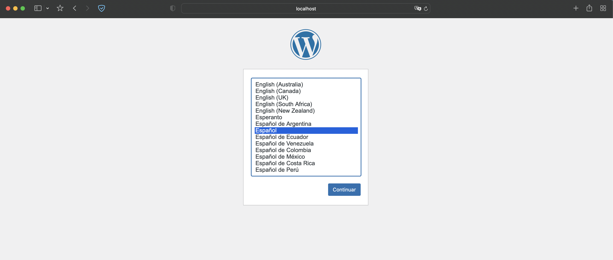
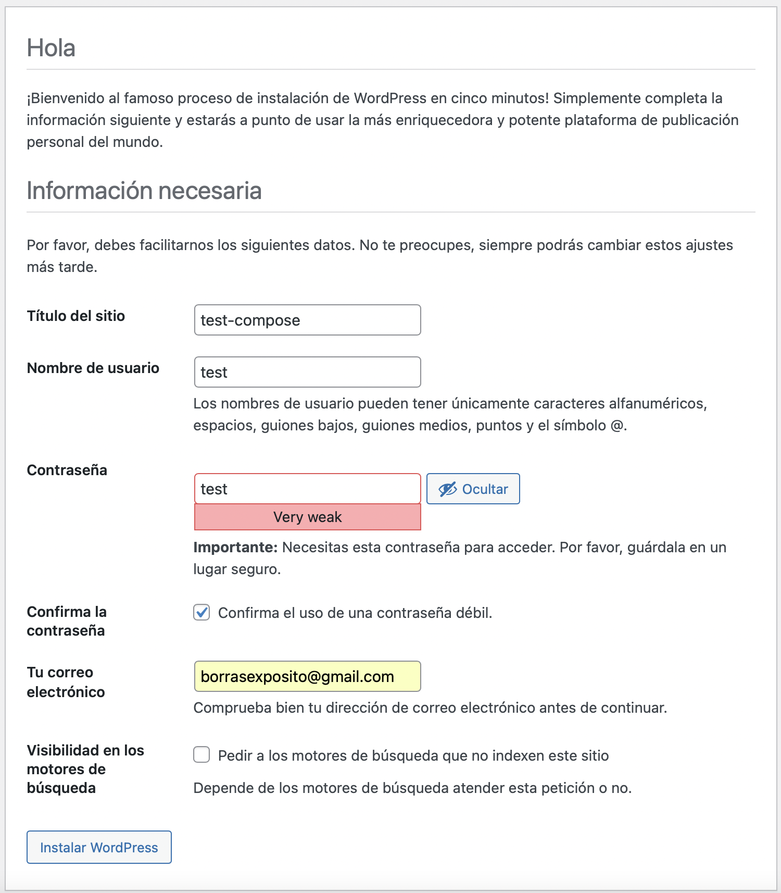
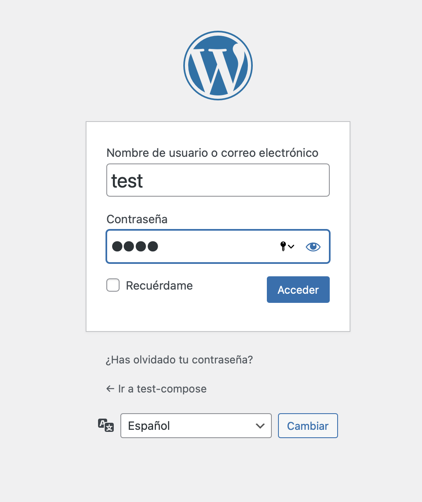

## Docker compose con Wordpress

En primer lugar, hay que crear un docker-compose.yaml donde se indiquen las imágenes junto a su configuración:

```yaml
services:

  wordpress:
    image: arm64v8/wordpress:5-php7.4-apache
    ports:
        - 8080:80
    environment:
        WORDPRESS_DB_HOST: mysql
        WORDPRESS_DB_USER: root
        WORDPRESS_DB_PASSWORD: root
        WORDPRESS_DB_NAME: wordpress
    links:
        - mysql:mysql

  mysql:
    platform: linux/x86_64/v8
    image: mysql:latest
    command: --default-authentication-plugin=mysql_native_password
    environment:
        MYSQL_DATABASE: wordpress
        MYSQL_ROOT_PASSWORD: root
```

Aquí se indican las dos imagenes que se usarán:

- Una imagen que contiene el wordpress.
- Otra imagen con un servidor mysql.

Seguidamente, situándote en el directorio donde se encuentra el compose, realizar:

```bash
docker compose up
````

Al levantar el docker, en el puerto 8080 debería salir la página de inicio de Wordpress tal como se indica aquí:



Como ejemplo, para comprobar que se instala correctamente Wordpress en el compose, realizaré el flujo de instalación de Wordpress.






